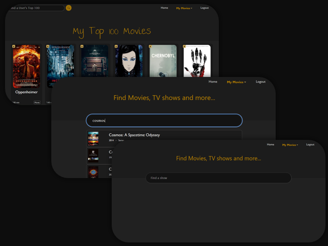
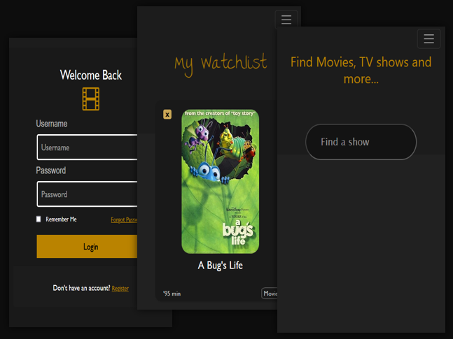

# Movies' Fullstack Website

While I was looking at my IMDb watchlist, which was really huge - over 500 movies to watch - I found the prospect overwhelmingly exciting. It made me think, why not create a Full-Stack website to keep track of ‘watched’, ‘to watch’, and ‘my top 100’ movies? 

## Features

- **Seen**: Keep track of the moviesI have watched.
- **Top 100**: Check out the top 100 movies according to user ratings.
- **Watchlist**: Save movies I want to watch later.
- **User Authentication**

## Usage

After logging in, you can perform CRUD (Create, Read, Update, Delete) operations on your movie lists. You can search for movies, add them to your ‘seen’ list or ‘watchlist’, update your lists as you watch more movies, and even delete movies from your lists. Additionally, you can check out the top 100 movies and explore other people’s top 100. The application also supports user authentication to ensure that your lists are personalized.

## Technologies Used

This project was built using the following technologies:

- **Frontend**: React-TS, TypeScript, HTML/CSS, Bootstrap, Vite
- **Backend**: Node.js, Express, MySQL, Sequelize, CORS, Nodemon, JWT

### To Run it
```
git clone https://github.com/oebelus/moviesTs.git
```
```
cd back
npx tsc
node build/index.js
```
```
cd front
npm run dev
```

## Screenshots




